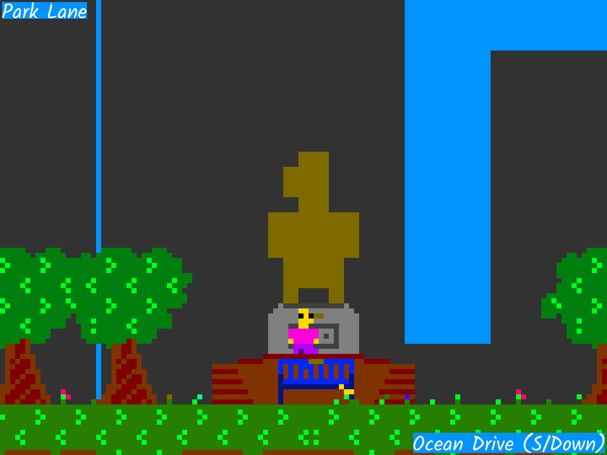

# A City Minute
A City Minute is my Ludum Dare 53 game jam entry developed in 72 hours, written in PyGame. It's a 2D open world platformer with a short main story around the jam theme of 'Delivery'. The game features 3 streets and many building interiors and NPCs.

*a-city-minute-WINDOWS.zip* contains the playable executable.

At the time of uploading this, the Ludum Dare website is down, so I don't have access to the reviews, original post, or walkthrough I wrote.

Based on my memory, the game got very middling scores from 20+ players. Many people were confused by what to do and the very fast movement. Even if it's not for everyone, I'm still really enamored with the idea of a open world 2D platformer and hope to continue developing this idea some day, incorporating the feedback I got. 

Player sitting in Park Lane:

